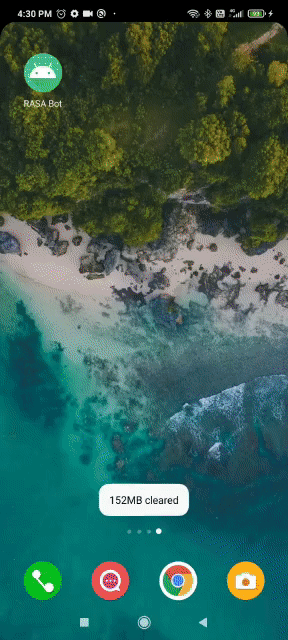
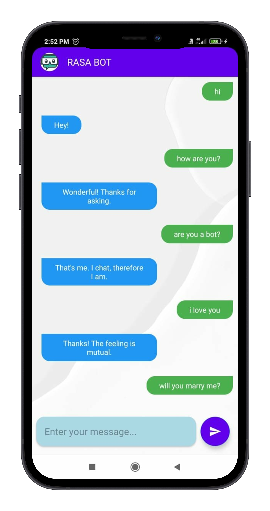
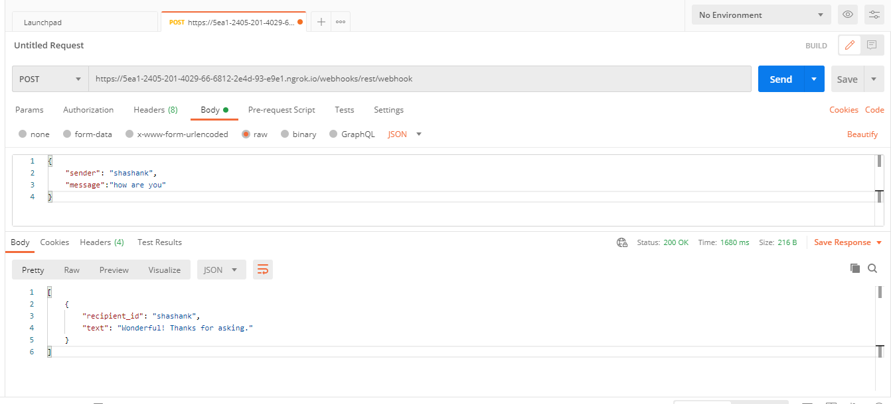

# Chatbot App

 

 | Mood Bot                            | Small Talk Bot                      |
 |-------------------------------------|-------------------------------------|
 | | |
 
 
  
 
I have made a simple chat application which sends user message to RASA server, and sends response back to user - both text and image. There are 2 main parts:

- RASA Model
- Chat App

 

## What is RASA ?

RASA is an Open-Source machine learning framework for building contextual AI assistants and chatbots. It Consists of 2 components – 
1.	Natural Language Understanding (NLU)
2.	Dialogue Management aka Core

 

NLU: Ear of assistant. Help assistant to understand what is being said. It Takes user input in an unstructured human language and extract structured data in form of intents and entities.

 

Dialogue Management (Core):  -	Brain of Assistant.	Makes decision of how an assistant should respond based on specific state of conversation as well as context. -	Core learns by observing patterns from conversational data between user and Assistant (aka stories).

 

## Rasa install and setup

1. open/create virtual-env and activate it

2. <i>pip install rasa</i>

3. cd to project dir

4. <i>rasa init</i> - It will setup initial rasa project named Mood bot

5. For training model- <i>rasa train</i>

6. For running model- <i>rasa shell</i>

 

## Expose Rasa server

1. open virtual-env and cd to project dir

2. <i>rasa train</i>

3. <i>rasa run -m models --enable-api --endpoints endpoints.yml</i> - note the port no of local host

4. open ngrok and type- <i>ngrok http PORT-NO</i> (eg- ngrok http 5005)

5. copy https link - base url for making request from android app

 

## Testing Rasa Server on Postman

1. Open postman

2. Make POST request to - NGROK-HTTPS-URL/webhooks/rest/webhook. (eg- https://5ea1-2405-201-4029-66-6812-2e4d-93-e9e1.ngrok.io/webhooks/rest/webhook)

3. Select Body, choose raw and input data in JSON format. 

eg- {
    "sender": "shashank",
    "message":"how are you"
})

4. click send and observer response.

 

## Chat App

I used retrofit inside my chat app to make POST request to RASA server and display response to user. I have used MVVM architecture to better organize my project and handle configuration changes. There are 3 types of views used in recycler view of chat conversation:

1. user message
2. bot message
3. bot loading message

 

#### Libraries used - 
- Retrofit
- Gson
- Glide
- ViewModel
- Material Design
- Executor Services

 

Visit [here](https://github.com/cedextech/rasa-chatbot-templates), for pre-built rasa models.
