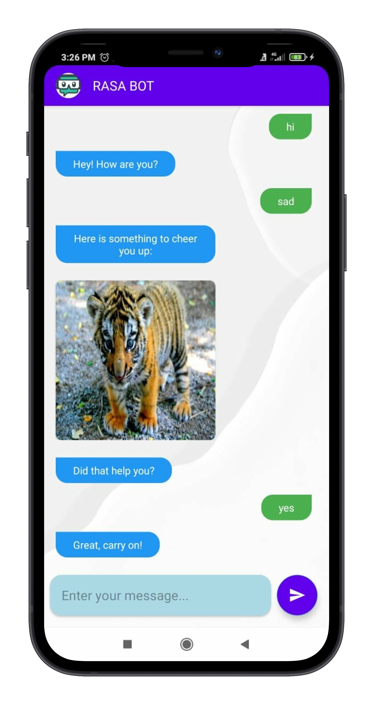

# Chatbot App

 

 | Mood Bot                            | Small Talk Bot                      |
 |-------------------------------------|-------------------------------------|
 | | |
 
 
  
 
I have made a simple chat application which sends user message to RASA server, and sends response back to user - both text and image. There are 2 main parts:

- RASA Model
- Chat App

 

## What is RASA ?

RASA is an Open-Source machine learning framework for building contextual AI assistants and chatbots. It Consists of 2 components – 
1.	Natural Language Understanding (NLU)
2.	Dialogue Management aka Core

 

NLU: Ear of assistant. Help assistant to understand what is being said. It Takes user input in an unstructured human language and extract structured data in form of intents and entities.

 

Dialogue Management (Core):  -	Brain of Assistant.	Makes decision of how an assistant should respond based on specific state of conversation as well as context. -	Core learns by observing patterns from conversational data between user and Assistant (aka stories).
